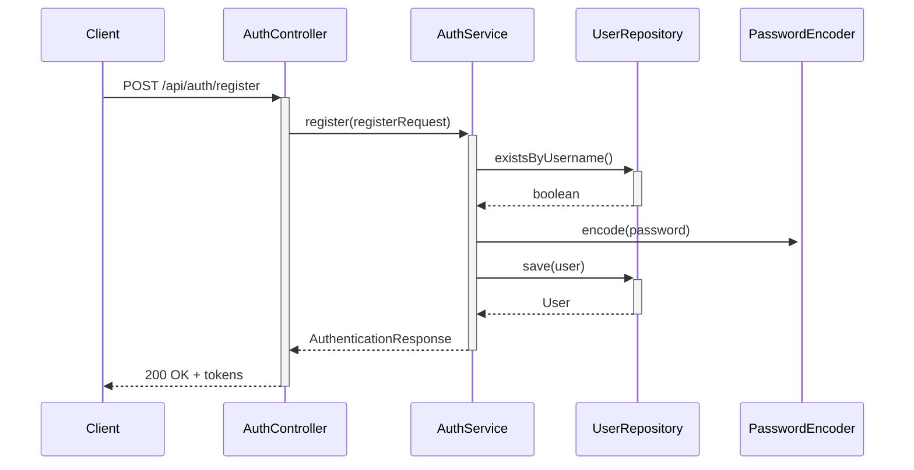
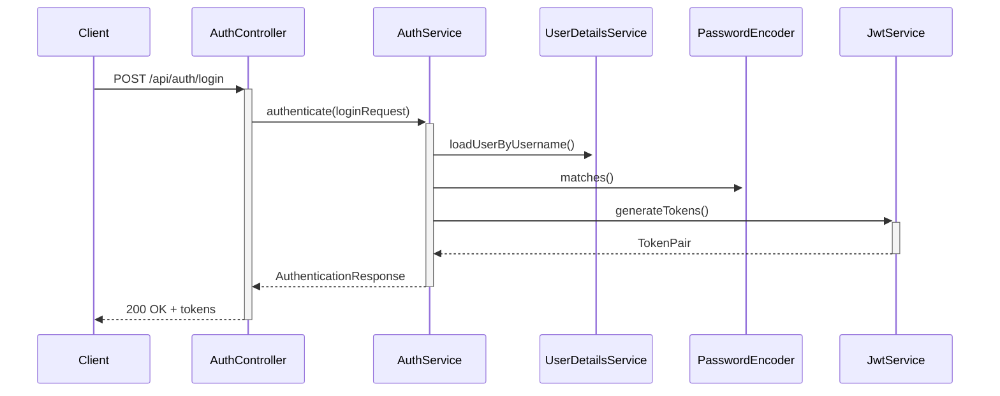

# Spring Boot JWT Authentication - Technical Architecture

## Table of Contents
1. [System Architecture](#system-architecture)
2. [Authentication Flow](#authentication-flow)
3. [Token Management](#token-management)
4. [Security Implementation](#security-implementation)
5. [Database Schema](#database-schema)
6. [API Design](#api-design)
7. [Error Handling](#error-handling)
8. [Performance Considerations](#performance-considerations)
9. [Scalability](#scalability)
10. [Monitoring and Logging](#monitoring-and-logging)

## System Architecture

### Component Diagram
```
+----------------+     +------------------+     +------------------+
|                |     |                  |     |                  |
|   Client App   |<--->|  Spring Boot App  |<--->|  H2 Database    |
|  (Browser/     |     |  (REST API)      |     |  (In-memory)    |
|   Mobile)      |     |                  |     |                  |
+----------------+     +------------------+     +------------------+
                            |         |
                            |         |
                            v         v
                    +------------------+  +------------------+
                    |  Spring Security |  |   JWT Utilities  |
                    |  (Authentication |  |  (Token Gen/Val) |
                    |   & AuthZ)       |  |                  |
                    +------------------+  +------------------+
```

### Core Components

1. **Controllers**
   - `AuthController`: Handles authentication-related endpoints
   - `ProductController`: Manages product CRUD operations

2. **Services**
   - `AuthService`: Business logic for authentication
   - `JwtService`: Handles JWT token generation and validation
   - `UserDetailsServiceImpl`: Custom user details service for Spring Security

3. **Security**
   - `SecurityConfig`: Main security configuration
   - `JwtAuthenticationFilter`: Validates JWT tokens in requests
   - `JwtAuthenticationEntryPoint`: Handles unauthorized requests

4. **Data Layer**
   - `UserRepository`: Data access for User entity
   - `ProductRepository`: Data access for Product entity

## Authentication Flow

### 1. Registration


### 2. Login


## Token Management

### JWT Structure
1. **Header**
   ```json
   {
     "alg": "HS256",
     "typ": "JWT"
   }
   ```

2. **Payload**
   ```json
   {
     "sub": "username",
     "iat": 1624387200,
     "exp": 1624473600,
     "roles": ["ROLE_USER"],
     "tokenType": "access"
   }
   ```

### Token Types
1. **Access Token**
   - Short-lived (default: 24h)
   - Used for API authorization
   - Stored in memory (client-side)

2. **Refresh Token**
   - Longer-lived (default: 7 days)
   - Used to obtain new access tokens
   - Securely stored (HTTP-only cookie recommended)

## Security Implementation

### Spring Security Configuration
```java
@Configuration
@EnableWebSecurity
@EnableMethodSecurity
public class SecurityConfig {
    // Security filter chain configuration
    // CORS, CSRF, Session Management
    // Authentication provider
    // Authorization rules
}
```

### JWT Filter Chain
1. Extract token from Authorization header
2. Validate token signature and expiration
3. Set authentication in SecurityContext
4. Continue filter chain

## Database Schema

### Users Table
```sql
CREATE TABLE users (
    id BIGINT PRIMARY KEY AUTO_INCREMENT,
    username VARCHAR(50) UNIQUE NOT NULL,
    password VARCHAR(255) NOT NULL,
    full_name VARCHAR(100) NOT NULL,
    created_at TIMESTAMP DEFAULT CURRENT_TIMESTAMP,
    enabled BOOLEAN DEFAULT TRUE
);
```

### Roles Table
```sql
CREATE TABLE roles (
    id BIGINT PRIMARY KEY AUTO_INCREMENT,
    name VARCHAR(20) UNIQUE NOT NULL
);

CREATE TABLE user_roles (
    user_id BIGINT,
    role_id BIGINT,
    PRIMARY KEY (user_id, role_id),
    FOREIGN KEY (user_id) REFERENCES users(id),
    FOREIGN KEY (role_id) REFERENCES roles(id)
);
```

## API Design

### Request/Response Examples

**Register**
```http
POST /api/auth/register
Content-Type: application/json

{
  "username": "user1",
  "password": "password123",
  "fullName": "John Doe"
}
```

**Login**
```http
POST /api/auth/login
Content-Type: application/json

{
  "username": "user1",
  "password": "password123"
}
```

**Refresh Token**
```http
POST /api/auth/refresh
Content-Type: application/json

{
  "refreshToken": "eyJhbGciOiJIUzI1NiIsInR5cCI6IkpXVCJ9..."
}
```

## Error Handling

### Custom Exceptions
- `ResourceNotFoundException`: 404 Not Found
- `AuthenticationException`: 401 Unauthorized
- `AccessDeniedException`: 403 Forbidden
- `MethodArgumentNotValidException`: 400 Bad Request

### Error Response Format
```json
{
  "timestamp": "2023-01-01T12:00:00Z",
  "status": 400,
  "error": "Bad Request",
  "message": "Validation failed",
  "path": "/api/auth/register"
}
```

## Performance Considerations

1. **Token Validation**
   - Signature verification is CPU-intensive
   - Consider using RSA for better performance with public/private keys

2. **Database Queries**
   - Minimize database hits during authentication
   - Use caching for frequently accessed user data

3. **Token Storage**
   - Use in-memory storage for active refresh tokens
   - Implement token blacklisting for immediate revocation

## Scalability

### Horizontal Scaling
- Stateless authentication allows easy scaling
- Shared token validation secret/key across instances
- Consider using a distributed cache for token blacklisting

### Database Scaling
- Use connection pooling
- Implement read replicas for high-traffic scenarios
- Consider NoSQL for high-write scenarios

## Monitoring and Logging

### Key Metrics to Monitor
- Authentication success/failure rates
- Token generation/validation times
- Database query performance
- API response times

### Logging Strategy
- Structured logging with correlation IDs
- Security-relevant events (logins, token refreshes)
- Error conditions and exceptions

## Future Enhancements

1. **Multi-factor Authentication**
   - Add support for TOTP or SMS verification

2. **OAuth2 Integration**
   - Support social login providers
   - Implement OAuth2 authorization server

3. **Rate Limiting**
   - Protect against brute force attacks
   - Implement request throttling

4. **API Documentation**
   - Integrate Swagger/OpenAPI
   - Generate interactive API documentation
