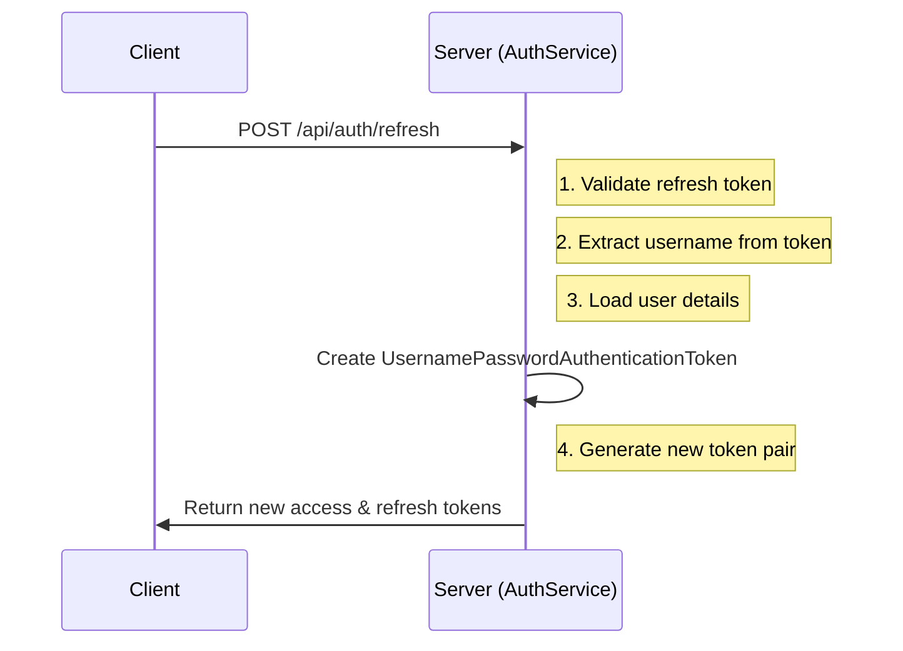

# Authentication Flow in Spring Boot JWT Application

This document explains the authentication mechanism used in the application, focusing on the role of `UsernamePasswordAuthenticationToken` and the JWT token refresh flow.

## Table of Contents
1. [Authentication Overview](#authentication-overview)
2. [Key Components](#key-components)
3. [Token Refresh Flow](#token-refresh-flow)
4. [UsernamePasswordAuthenticationToken Explained](#usernamepasswordauthenticationtoken-explained)
5. [Stateless Authentication](#stateless-authentication)
6. [Security Considerations](#security-considerations)

## Authentication Overview

The application uses JSON Web Tokens (JWT) for stateless authentication. The flow consists of:

1. **Login**: User provides credentials and receives an access token and a refresh token
2. **Accessing Protected Resources**: Client includes the access token in the Authorization header
3. **Token Refresh**: When the access token expires, the client uses the refresh token to get a new token pair

## Key Components

### 1. JWT Tokens
- **Access Token**: Short-lived token (typically 15-60 minutes) used to access protected resources
- **Refresh Token**: Longer-lived token used to obtain new access tokens without re-authentication

### 2. Security Filters
- `JwtAuthenticationFilter`: Validates JWT tokens in incoming requests
- `RequestLoggingFilter`: Logs incoming requests for debugging purposes

### 3. Core Services
- `AuthService`: Handles authentication logic
- `JwtService`: Manages JWT token creation and validation
- `UserDetailsService`: Loads user-specific data

## Token Refresh Flow



## UsernamePasswordAuthenticationToken Explained

### What is it?
`UsernamePasswordAuthenticationToken` is a Spring Security class that implements the `Authentication` interface. It's a simple in-memory object used to represent an authenticated user during a single request/response cycle.

### Key Characteristics
- **In-Memory**: Exists only in JVM heap during request processing
- **Short-Lived**: Created when needed and garbage-collected after use
- **Not Persisted**: Not stored in database or session

### In Refresh Token Flow
```java
// From AuthService.refreshToken()
UsernamePasswordAuthenticationToken authentication = new UsernamePasswordAuthenticationToken(
    user,                   // The authenticated user (Principal)
    null,                   // Credentials (null as we don't need password here)
    user.getAuthorities()   // User's roles/permissions
);
```

### Why Use It?
1. **Spring Security Integration**: Required by Spring's security context
2. **Temporary Authentication**: Represents the user just long enough to generate new tokens
3. **Stateless**: Maintains no server-side state between requests

## Stateless Authentication

### How It Works
1. Client stores JWT tokens (access_token and refresh_token)
2. Each request includes the access token
3. Server validates the token for each request
4. No server-side session storage needed

### Benefits
- **Scalability**: No need for session affinity
- **Performance**: No database lookups for each request
- **Simplicity**: No session management required

## Security Considerations

1. **Token Security**
   - Always use HTTPS
   - Set appropriate token expiration times
   - Store tokens securely on the client-side

2. **Refresh Tokens**
   - Should have limited lifetime
   - Should be securely stored (HttpOnly, Secure flags)
   - Can be revoked if needed

3. **Token Validation**
   - Validate token signature
   - Check token expiration
   - Verify token issuer and audience

## Best Practices

1. **Token Management**
   - Use short-lived access tokens (15-60 minutes)
   - Implement token rotation
   - Handle token expiration gracefully

2. **Error Handling**
   - Return appropriate HTTP status codes
   - Provide clear error messages
   - Log security-related events

3. **Monitoring**
   - Monitor authentication attempts
   - Track token usage patterns
   - Set up alerts for suspicious activities

## Related Files

- `AuthService.java`: Implements authentication logic
- `JwtService.java`: Handles JWT operations
- `SecurityConfig.java`: Configures security settings
- `JwtAuthenticationFilter.java`: Validates JWT tokens

## References

- [Spring Security Documentation](https://docs.spring.io/spring-security/site/docs/current/reference/html5/)
- [JWT Introduction](https://jwt.io/introduction/)
- [OAuth 2.0 and OpenID Connect](https://auth0.com/docs/protocols/oauth2)
